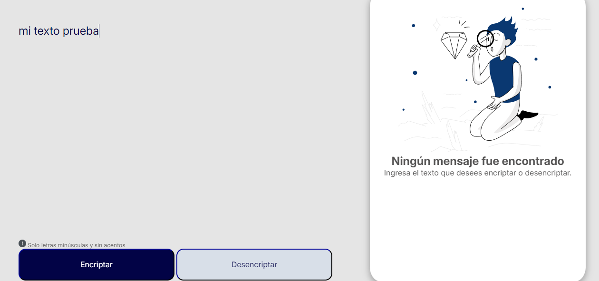
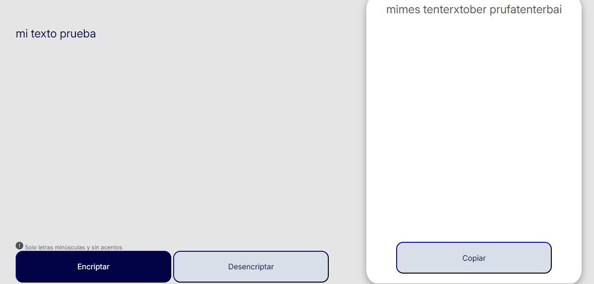
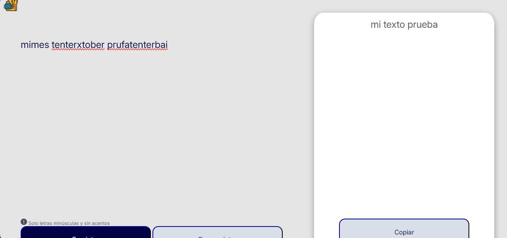
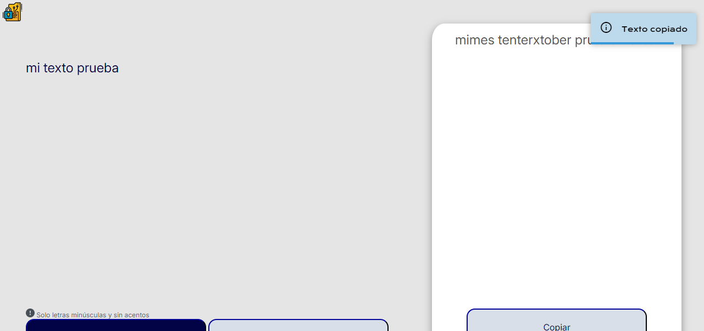
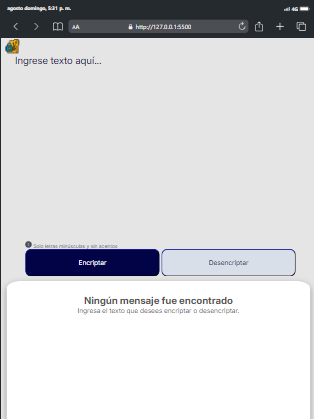
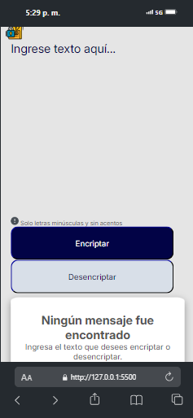
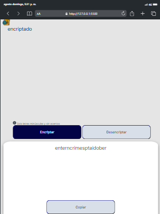
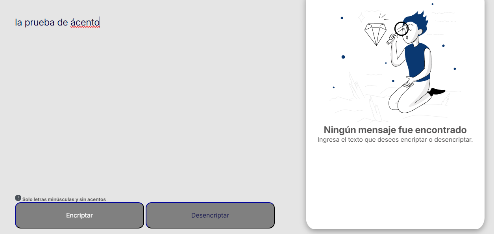
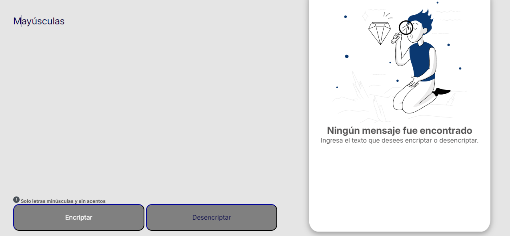

# 💾 Reto Encriptador Alura

Aplicación que encripta y desencripta texto, además de copiar el texto dentro del campo resultado informando al usuario con un mensaje emergente de información. 

Por otro lado, detecta el ingreso de mayúsculas o palabras con acentos lo que nos lleva a la deshabilitación de botones y enfatizar en el texto informativo acerca de estas condiciones.

# 💥 Funcionalidades

- **Encriptación** de texto en el área de inserción.
- **Desencriptación** de texto en el área de inserción.
- **Copiado** de texto en campo resultado.
- **Validación** de carácteres para no tener en cuenta mayúsculas o acentos.
- **Información** al usuario por medio de mensaje emergente el copiado del texto.

# Imágenes 📷

### Imagen inicial de app 📍

Vista inicial de la aplicación en el escritorio.

    

### 🔏 Encriptacion/Desencriptacion 🔓

Imagen donde se muestra la funcionalidad de encriptar y desencriptar el texto.

    
    

### Toast texto copiado 💬

Funcionalidad del aviso al usuario del texto copiado mediante un toast o mensaje emergente por cierta cantidad de tiempo.

    

### 💻 Responsividad 📱

- Imagen inicial en ambos dispositivos evidenciando las diferencias visuales.

    
    

- Imagen de encriptación en ambos dispositivos evidenciando sus diferencias visuales debido a la cantidad de espacio disponible de los dispositivos.

    
    

### ✔️ Validaciones ❌

Imágenes que nos muestran las validaciones que se tienen en cuenta (mayúsculas o acentos) y las derivaciones que causan en la aplicación como cambio de color en botones, deshabilitación de botones y el mensaje toma un tono mas fuerte para generar enfatización en el texto.

    
    

# Recursos 💊

- [**Ocultar/mostrar**](https://stackoverflow.com/questions/6242976/javascript-hide-show-element): Foro en donde se encuentran opciones acerca de como ocultar o mostrar elmentos con JS.

- [**Ocultar/mostrar por clase**](https://stackoverflow.com/questions/31279413/dynamically-change-css-style-by-class-name): Ocultar o mostrar por el nombre de la clase con JS.

- [**Replace con JS**](https://developer.mozilla.org/en-US/docs/Web/JavaScript/Reference/Global_Objects/String/replace): Función replace documentación oficial.

- [**Dictionary to regex**](https://stackoverflow.com/questions/42988082/replace-letters-in-string-with-a-dictionary-array-set-in-javascript): Usando un diccionario para realizar el remplazo de palabras.

- [**Vocales**](https://www.freecodecamp.org/espanol/news/expresiones-regulares-regex-en-javascript-manual-para-principiantes/): Patrón de vocales para asociar con el diccionario.

- [**Diccionario JS**](https://medium.com/@onlinemsr/how-to-use-javascript-dictionary-like-a-pro-82b00599a16d): Uso de diccionario para realizar el remplazo de palabras (descifrado).

- [**Toast**](https://www.geeksforgeeks.org/how-to-make-a-toast-notification-in-html-css-and-javascript/): Toast para dar la información del texto copiado.